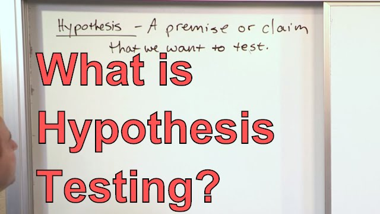

# Hypothesis testing

Let us start by defining the simplest, but most relevant concept we need to understand: hypothesis. This might be overlooked sometimes and it is, generally, easy to define. So simple, that sometimes people tend to skip it... but then is when interpretability problems come: what were we testing? is this metric good or bad? it is bad, but bad for A, bad for B? 😵‍💫

So let us start simple, let us first analyse a super simple scenario in which hypothesis testing appears just naturally as one tries to put words into the problem.

[Link to video](https://www.youtube.com/watch?v=5D1gV37bKXY)

Ok, that was a fun experiment, but now let us go a little bit closer to Math and put some terms on top of the table. Here you have a nice introduction to some of the main concepts that one has to take into account when dealing with hypothesis testing:

[Link to video](https://www.youtube.com/watch?v=VK-rnA3-41c)

From here on, we will follow the next path:
- understanting a little bit more above the latter concepts
- define error types
- delve into statistical tests 