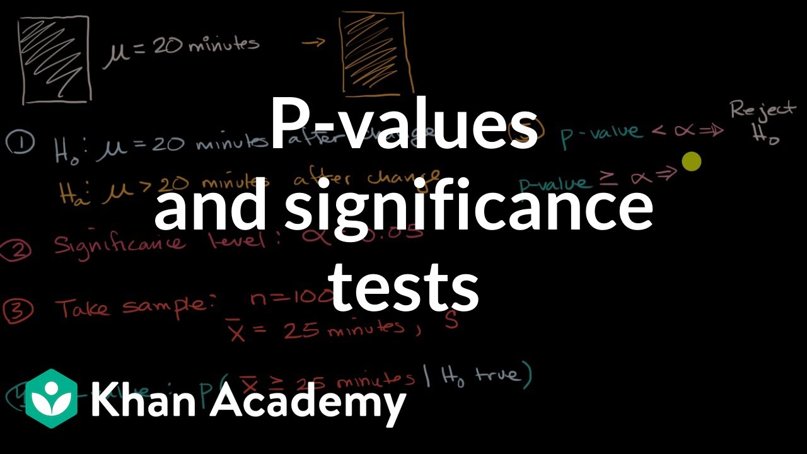
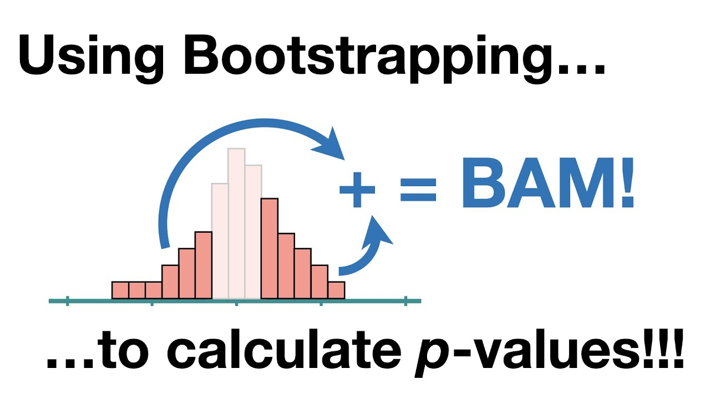

# p-values and significance level

Once we have stablished what we want to study and how we are going to set it up, we need to decide about the outcome... what? We have not even performed the analysis and we already need to say something about the result? Yes! We need to determine what will be enough for us to decide upon whatever result we observe. This comes in the form of _significance level_. It is just a number we stablish **beforehand** to decide whether or not to interpret our result as definitive or inconclusive. Closely related to it is the _p-value_. This, in contrast, is a number what comes **after** the experiment and will immediately translate into a conclusion upon comparison against the significance level. So basically, a significance level is our threshold for accepting something as statistically relevant and the p-value is a calculation that will tell us if we are over or below this threshold. In the following video, you have an integration of these concepts in the context of hypothesis testing. 

[Link to video](https://www.youtube.com/watch?v=KS6KEWaoOOE)

Note that these quantities we have defined come as probabilites or certainties, but how can we use them to define relevant tangible quantities? Introduce the confidence intervals! These are obtained via a technique called bootstraping and we present to you one of the best youtubers for anything related to Data Science and Statistics: StatQuest!

[Link to video](https://www.youtube.com/watch?v=Xz0x-8-cgaQ)

And now that you understand confidence intervals, let us connect it to p-values.

[Link to video](https://www.youtube.com/watch?v=N4ZQQqyIf6k)

Finally, let us collect all the things we have learned and do a quick review on the concepts:

[Link to video](https://www.youtube.com/watch?v=yDEvXB6ApWc)
