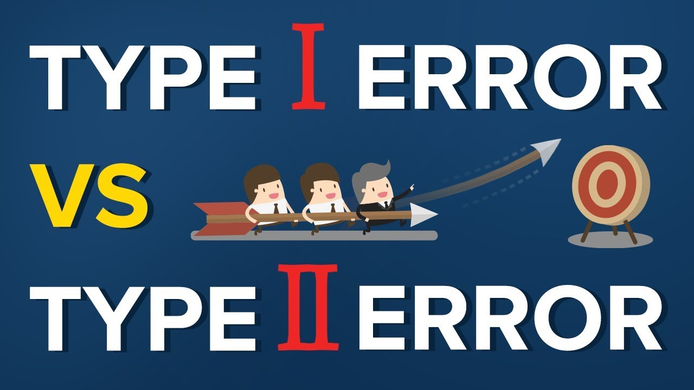
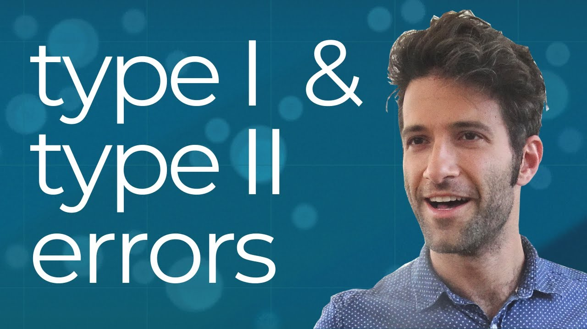
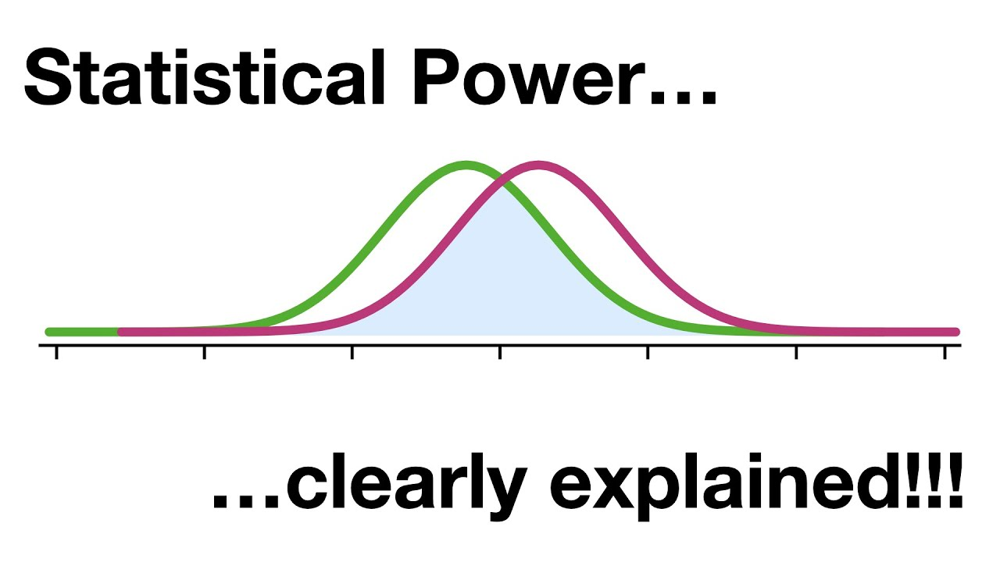

# Type I and type II errors 🎯

If you are familiar with binary classification tasks, you will probably know Type I error as False Positive and Type II error as False Negative. In the field of Statistics, the common denomination is Type I and Type II error. 

However, there is a small difference with respect to classification tasks. When designing hypothesis testing, there is an innate worse error, the type I error. This is because you have little control over it, while being responsible for determining the level of significance. In contrast, type II error depends on sample size and its distribution, so reducing it is a matter of gathering more data.

Of course, these are general considerations at the design and mathematical sense. In practice, the relevance of Type I and Type II errors might be given by the hypothesis itself.

In here, we present the classical confusion matrix, with the objective to illustrate how to connect these types of errors to the mathematical concepts we will discuss.

|       | **Decision**             | **Decision**             |
|-------|--------------------------|--------------------------|
|       | **Accept Null Hypothesis**   | **Reject Null Hypothesis**   |
| **Reality** |                          |                          |
| **True Null Hypothesis**   | Correct Decision (True Negative)   | Type I Error (False Positive) $\alpha$ (Significance level) |
| **False Null Hypothesis** | Type II Error (False Negative) $\beta$ (Beta) | Correct Decision (True Positive) Power = $1 -\beta$ |

Here you have a quick introduction to error types.

[Link to video](https://www.youtube.com/watch?v=a_l991xUAOU)

while in here you will understand the connection between the errors and the quantities

[Link to video](https://www.youtube.com/watch?v=CJvmp2gx7DQ)

Finally, a nice explanation on how power relates to determining meaningful results

[Link to video](https://www.youtube.com/watch?v=Rsc5znwR5FA)
