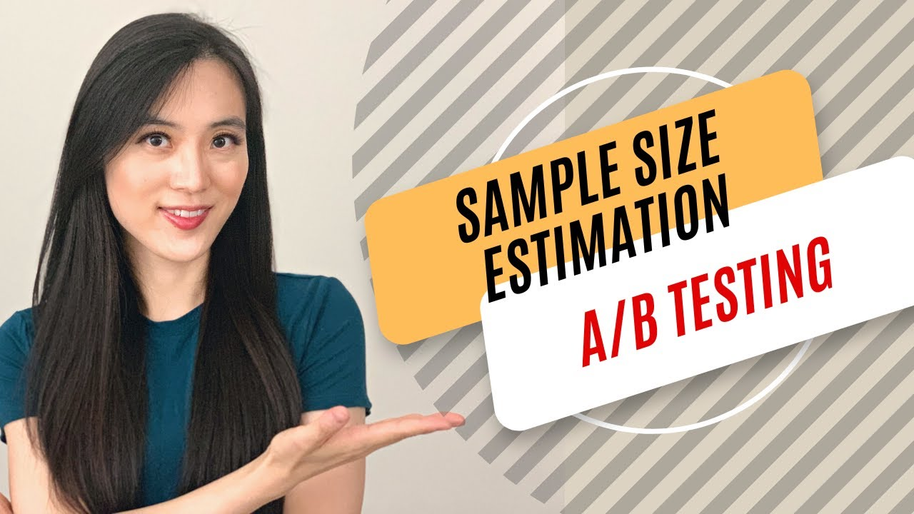

# Estimating sample size

One of the most relevant quantities to determine when designing an experiment is the sample size. It controls whether we can ensure to have statistically significant results or not, but its estimation is not particularly easy. Fortunately, statiticians sometimes care about explaining these concepts and in the following video we have a detailed explanation on how to do this.


[Link to video](https://www.youtube.com/watch?v=KC1nwY7YCUE)


Now, you should understand why this section uses the word estimating and not the word calculating or computing. It is necessary to do some educated guesses and non-exact calculations to determine a sample size. 

Theoretical calculations are great for understanding the concepts, but in practise, we want to use Python to automize these calculations. You can find a simple example in [`test_size_determination_example.py`](test_size_determination_example.py), where we will use some `statsmodel` functions


- `proportion_effectsize` calculates the effect size (often referred to as "Cohen's h") based on two proportions. In the context of A/B testing, these proportions are the baseline conversion rate (your current conversion rate) and the expected conversion rate after the change (which is the sum of the baseline rate and the minimum detectable effect you wish to observe).
- `NormalIndPower()` initializes an object that represents the power of a test based on normal distributions (appropriate for large sample sizes in A/B tests).
- `solve_power` is a method of the NormalIndPower class. It computes one of the four components (effect size, number of observations, alpha, power) of a power analysis, given the other three components. Here, we're solving for the number of observations (i.e., sample size).

    - `effect_size` is the difference in proportions we're trying to detect.

    - `alpha` is the significance level (Type I error rate).

    - `power` is the probability of correctly rejecting the null hypothesis when the alternative hypothesis is true (1 minus the Type II error rate).

    - `ratio` is the ratio of the number of samples in one group to the other. Setting this to 1 means both groups (A and B) will have the same sample size.

In summary, these two lines determine the minimum number of samples you need in each group (A and B) to detect a specified minimum effect with a given confidence and power.

Another short example:
```python

from statmodels.stats.power import tt_ind_solve_power
from statsmodels.stats.proportion import proportion_effectsize

es = proportion_effectsize(0.03, 0.0315)
n = tt_ind_solve_power(effect_size=es, ratio=1, power=0.8, alpha=0.05)
```

This basically means that you will need to think about the test you want to perform and find the suitable way of doing this calculation, so getting familiar with `statsmodel` is probably a good idea. You can start by skimming over the [`power` module and sample size calculations](https://www.statsmodels.org/devel/stats.html#power-and-sample-size-calculations).

As a final touch, we invite you to go through another video, in which all these concepts get revisited. 



[Link to video](https://www.youtube.com/watch?v=FKPec6RoJOg)
