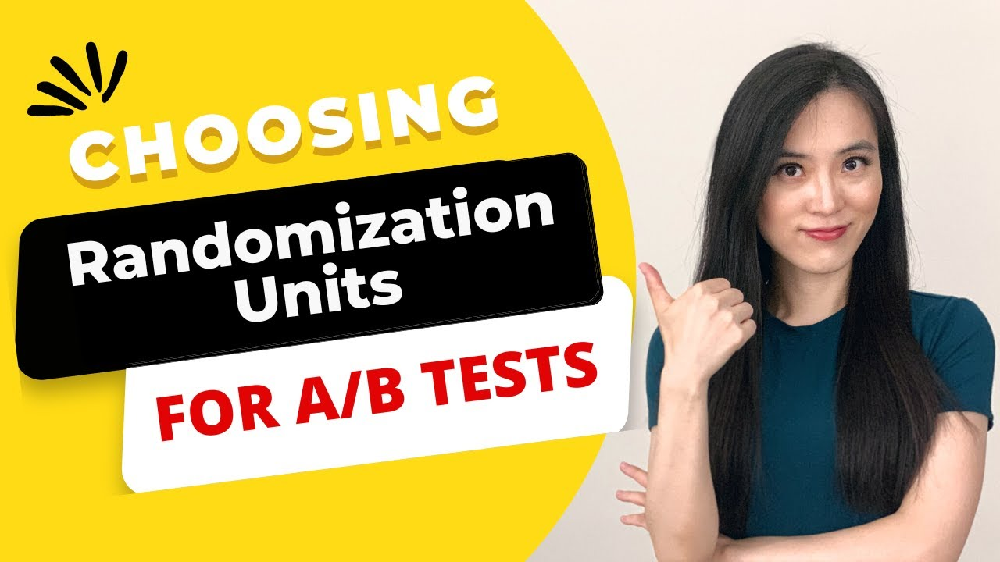

# Randomization 🎲

To design a statistically meaningful A/B testing, it is necessary to talk a bit about the concepts of randomization and control. Since you are most likely already familiar with it, we will just provide you with a fast overview.

## Why Randomization?

When testing a new feature or change, you don’t want any group to be inherently different from another due to some systematic bias.

So what is the purpose of randomization? When you randomize, you're making sure that both your groups (A & B) are similar in all ways except for the change you're testing. So, if there's a significant difference in the outcomes of these groups, you can be confident that it's because of the change you introduced.

## Methods of Randomization with Python

Python, with its vast libraries, makes it easy for us to implement randomization. The more popular ones being numpy, random and, of course, pandas. 

    Using numpy or random:
```python
import numpy as np

users = list(range(1000))
group_assignment = np.random.choice(['A', 'B'], size=len(users))
```

In the above example, each of the 1000 users is randomly assigned to either group A or B using numpy's random module. Using the random library is identical, as illustrated in the following example:

```python
import random

users = list(range(1000)) 
group_assignment = random.choice(['A', 'B'], size=len(users))
```

The most interesting tool however, would be stratified random sampling: sometimes, we want to make sure that certain segments of our population are represented equally in both groups. For instance, if we know that young users and older users behave differently on our website, we'd want both groups to have an equal mix of these two segments.

```python
    from sklearn.model_selection import train_test_split

    users = list(range(1000))
    age_group = ["young" if i < 500 else "old" for i in users]  # Assuming the first 500 users are young

    # Stratifying based on age group to ensure equal representation
    A_group, B_group = train_test_split(users, test_size=0.6, stratify=age_group)
```

Using the train_test_split function from scikit-learn, we can ensure that both A and B groups have an equal number of young and old users.

To wrap it up, we encourage you to listen to this video about randomization units. It discusses how to separate users in different scenarios. 



[Link to video](https://www.youtube.com/watch?v=IH2YdosJEZM)
