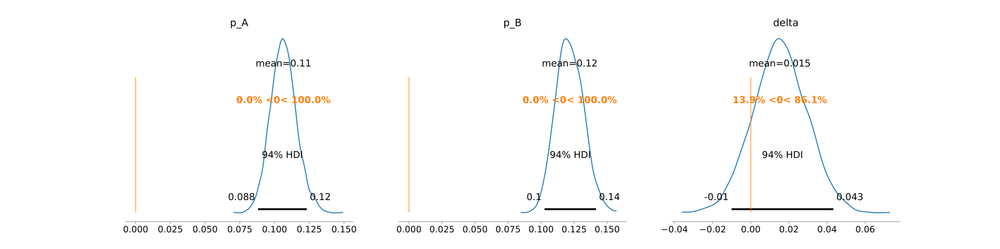

# Bayesian Statistics for A/B Testing 🧠🔄

Bayesian statistics is a powerful paradigm shift in the realm of A/B testing. Unlike the traditional frequentist methods that give point estimates and p-values, Bayesian methods produce a distribution of probable outcomes, allowing us to say, for instance, that there's a 95% probability that variant B is between 1% and 5% better than variant A.

## Bayesian vs Frequentist:

Frequentist methods rely solely on the data at hand without considering prior knowledge. At its core, Bayesian statistics operates on the principle of updating our beliefs based on new evidence, a. k. a., using the **Bayes theorem**. Therefore, we understand three main concepts:

- **Prior**: Our beliefs about a parameter before observing the current data.
- **Likelihood**: How our data is distributed given the parameter.
- **Posterior**: Our updated belief about the parameter after observing the data.

As such, understanding the **Bayes theorem** is fundamental to this section.


[Link to video](https://www.youtube.com/watch?v=HZGCoVF3YvM)

## How Does It Work?

When we run an A/B test using Bayesian methods, we start with a prior belief about our metric. As data from the test comes in, we update our beliefs using Bayes' theorem. The result is a posterior distribution that provides a more comprehensive view of likely outcomes, rather than a single point estimate.


[Link to video](https://www.youtube.com/watch?v=SP-sAAYvGT8)


## Dive into `PyMC3`:

`PyMC3` is a Python library that facilitates Bayesian modeling, offering a simple way to implement our analyses. Let us here present a simple example and some interpretations.

```python

import pymc3 as pm

# Sample data: conversions out of visitors for variant A and B
conversions_A = 105
visitors_A = 1000
conversions_B = 120
visitors_B = 1000

with pm.Model() as model:
    # Priors for unknown model parameters
    p_A = pm.Beta('p_A', alpha=2, beta=2)
    p_B = pm.Beta('p_B', alpha=2, beta=2)

    # Deterministic to calculate the difference between p_A and p_B
    delta = pm.Deterministic('delta', p_B - p_A)
    
    # Likelihood (sampling distribution) of observations
    obs_A = pm.Binomial('obs_A', n=visitors_A, p=p_A, observed=conversions_A)
    obs_B = pm.Binomial('obs_B', n=visitors_B, p=p_B, observed=conversions_B)
    
    # Sample from the posterior
    trace = pm.sample(2000, tune=1000)

# Analyze and visualize the posterior
pm.plot_posterior(trace, var_names=['p_A', 'p_B', 'delta'], ref_val=0)
```




In the above example, after sampling from the posterior, we can visualize the distributions of p_A, p_B, and delta (difference between B and A). This helps to analyse, for instance, the probability that variant B is better than variant A, and by how much.

## Why Use Bayesian for A/B Testing?

- **Incorporate Prior Knowledge**: Use historical data or domain knowledge to inform your tests.
- **Understand Uncertainty**: Gives a full distribution of possible outcomes, not just point estimates.
- **Flexibility**: Easily update your analysis as more data comes in without restarting the test.
- **Intuitive Results**: Directly infer probabilities like "There's an X% chance variant B is Y% better."


