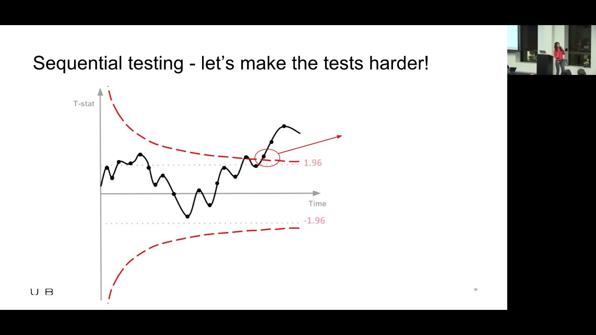

# Sequential testing 🧪⏲️⏩

Traditional A/B testing approaches often specify a fixed sample size in advance. However, in dynamic environments where rapid decision-making is essential, waiting for the entire sample might not be practical. Enter Sequential Testing, where we examine the data as it comes in and make decisions once we have enough evidence to do so, potentially before the predetermined sample size is reached.

## Basic Principle

Sequential testing methods allow for continuous monitoring of results. Once enough evidence is gathered to make a decision (either to accept or reject the null hypothesis), the test stops. This can lead to faster, more efficient decision-making, but care must be taken to control the Type I error rate (false positives) that can inflate with repeated checking.

Key Concepts

- **Boundaries**: Before starting the test, boundaries are set to determine when there's enough evidence to stop the test. These can be:
    - **Stopping for Success**: Indicating a variant is significantly better.
    - **Stopping for Failure**: Indicating there isn't a significant difference, and it's unlikely there will be.

- **Alpha Spending**: Given the multiple looks at the data, there's a risk of increasing the Type I error rate. The "alpha" (significance level) is therefore "spent" over the course of the test to maintain the overall desired significance level.



[Link to video](https://www.youtube.com/watch?v=4rWOx5fOJbg)


[Link to video (starts around min 32)](https://youtu.be/AJX4W3MwKzU?t=1934)

## Formula

In sequential testing, rather than waiting for the test to conclude, we continuously monitor the results and decide once we see a statistically significant difference between the variants.

To make this work, we need to set up "boundaries" for our test statistics. When our test statistic crosses one of these boundaries, we stop the test.

## An example: Wald's Sequential Probability Ratio Test (SPRT)

A common method for sequential testing is Wald's Sequential Probability Ratio Test (SPRT). The SPRT calculates the likelihood ratio of the observed data under two hypotheses and then compares this ratio to predefined boundaries.

Given two simple hypotheses $H_0:p=p_0$​ and $H_1:p=p_1$​, the likelihood ratio $L_n$​ after observing $n$ data points is:
$\begin{align}
Ln&=\left(\frac{p_1}{p_0}\right)^x\left(    \frac{1−p_1}{1−p_0}\right)^{n−x}
\end{align}$

Where $x$ is the number of successes observed.

For the test, we'll define two boundaries $A$ and $B$ such that $0<A<B$. At each stage $n$:

- If $L_n\leq A$, we reject $H_0$​.
- If $L_n\geq B$, we accept $H_0$​.
- If $A<L_n<B$, we continue sampling.

### Decision Boundaries

While the above is the likelihood ratio approach, in practice, it's often more intuitive to work with the logarithm of the likelihood ratios (log-likelihood ratios). Using log transformations, our boundaries become:
$$
\log⁡(B) \text{ and } \log⁡(A)
$$

Our stopping criteria then become:

- Stop and reject $H_0$​ if the log-likelihood ratio is less than $\log⁡(A)$.
- Stop and fail to reject $H_0$ if the log-likelihood ratio is greater than $\log⁡(B)$.

This method, using the log-likelihood, simplifies computations and is less affected by numerical issues in software.

### Python example

We'll set up a basic binary A/B test. Assume $p_0$ is the conversion rate of the control, and $p_1$​ is the conversion rate of the variant. We wish to determine if the variant is better than the control.

```python
import numpy as np

def sprt(p0, p1, alpha=0.05, beta=0.10):
    """
    Sequential Probability Ratio Test
    
    Parameters:
    - p0: conversion rate of control group
    - p1: conversion rate of treatment group
    - alpha: Type I error rate
    - beta: Type II error rate
    
    Returns:
    A string indicating the test result.
    """
    
    # Calculate boundaries
    A = (1-beta) / alpha
    B = beta / (1-alpha)
    
    # Initial values
    log_likelihood_ratio = 0
    n = 0
    
    while True:
        # Simulate data for control and treatment
        x0 = np.random.binomial(1, p0)
        x1 = np.random.binomial(1, p1)
        
        # Update the log likelihood ratio
        log_likelihood_ratio += np.log(p1/p0) if x1 else np.log((1-p1)/(1-p0))
        
        n += 1
        
        # Check boundaries
        if log_likelihood_ratio < np.log(A):
            return "Reject H0: The treatment group is better"
        elif log_likelihood_ratio > np.log(B):
            return "Fail to reject H0: No significant difference between groups"
        
        # For practical purposes, we may want to limit the number of iterations
        if n > 10000:
            return "Test inconclusive: Maximum number of iterations reached"

# Example usage
print(sprt(0.5, 0.52))
```

Note:

1. The above code assumes that the conversion rate of the variant ($p_1$​) is better than the control. If you wish to test the other direction (if the control is better), you would need to adjust the boundaries.
2. The sprt function simulates user conversions based on given conversion rates for both groups. In a real scenario, you'd replace the simulated data with actual user conversion data.
3. A maximum number of iterations (10000 in this case) is added to avoid potential infinite loops, but this can be adjusted as per the use case.

## In Practice

While sequential testing allows for faster decisions, it also requires continuous monitoring, and there's a risk associated with stopping tests too early. It's essential to balance the eagerness to make a decision with the robustness of the results.

Remember that the boundaries and alpha spending strategy need to be defined in advance and should not be changed once the test begins. Doing so could invalidate the results.

Sequential testing is particularly advantageous in dynamic, high-velocity environments where early insights can lead to significant strategic advantages or cost savings. However, it's crucial to approach with care to ensure the validity and integrity of the results.  


